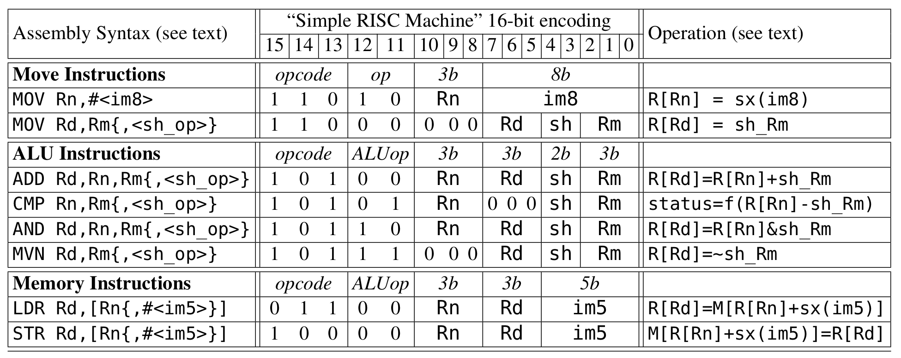

## Simple RISC Machine
The Verilog code in this repository designs a Reduced Instruction Set Computer, which
can execute 16 bit ARM v7 instructions that it is provided with. It is complete with 
its own program counter, register file, arithmetic logic unit, shifter, and instruction register. It uses a 5 stage cycle of instruction fetch, decode, execute, memory and 
writeback to execute each instruction. The design of this computer was very modular and test-driven with comprehensive
test benches to ensure the correctness of each component. ModelSim and Quartus were used 
to simulate and synthesize the computer, and it was designed to be used on an 
DE1-SoC Intel FPGA board. The instruction set for the computer is as follows: 

